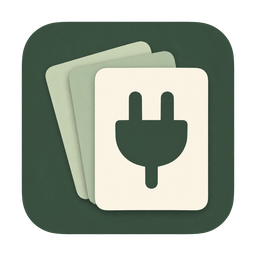

<div align="center">
  
  <h1>MCP Deck</h1>
  <p>A cross-platform desktop app for managing MCP configurations across AI agents</p>
  <p>
    <a href="https://github.com/Klien-m/mcp-deck/actions/workflows/release.yml"></a>
    <a href="https://github.com/Klien-m/mcp-deck/releases/latest"></a>
    
    
    
    
  </p>
  <p><a href="README.md">中文</a> | English</p>
</div>

---

MCP Deck keeps MCP configurations for multiple AI tools in one local service library. It discovers existing configurations, assigns a service to multiple tools, previews every change, detects conflicts, and creates backups before writing. You no longer need to edit JSON, JSONC, or TOML files by hand.

It supports Codex, Claude Code, Cursor, Gemini CLI, OpenCode, GitHub Copilot CLI, VS Code, Windsurf, Kiro, Cline, Roo Code, and Claude Desktop.

## Features

- **Unified service library** — Create, edit, search, and remove MCP services in one place, then assign them to multiple tools.
- **Configuration discovery** — Scan existing MCP configurations on first launch, import selected tools or services, and run discovery again at any time.
- **Multiple tools and targets** — Use 12 built-in tool adapters and add more than one configuration location for the same tool.
- **Format conversion** — Convert shared fields between JSON, JSONC, and Codex TOML while preserving untouched content and tool-specific fields.
- **Safe synchronization** — Preview full diffs, detect name conflicts and external edits, create backups, verify writes, and restore earlier configurations.
- **Import and export** — Import configuration text, export redacted templates by default, or explicitly export complete values.
- **Local first** — The service library, credentials, and backups stay on your computer. MCP Deck neither starts MCP servers nor hosts OAuth flows.

## Installation

Download the latest installer from [GitHub Releases](https://github.com/Klien-m/mcp-deck/releases):

| Platform            | Package                       |
| ------------------- | ----------------------------- |
| Windows x64         | `.exe` / `.msi`               |
| macOS Apple Silicon | `.dmg`                        |
| macOS Intel         | `.dmg`                        |
| Linux x64           | `.deb` / `.rpm` / `.AppImage` |

macOS 13.3 Ventura or later is required. Open the DMG and drag `MCP Deck.app` into Applications. The current macOS builds use ad hoc signing and are not notarized by Apple, so installations on another Mac may require approval in Privacy & Security.

> Only the macOS Apple Silicon build has completed full local build and acceptance testing. The release workflow produces the other packages, but they still need broader testing on physical machines.

## Quick Start

1. On first launch, choose which local MCP configurations to add to the service library. You can also skip this step and use **Discover local configurations** later.
2. Create or edit a service, then enable the tools that should receive it.
3. Select **Sync preview** and review the changes and conflicts for every target file.
4. Select **Apply**. MCP Deck creates a backup before writing and verifies the result afterward.
5. Refresh MCP or restart the target tool, then complete any authorization required by that tool.
6. To undo a change, restore it from **Sync history**. MCP Deck blocks the restore if another program has modified the target file.

If a default path does not match your installation, edit it under **Tools & paths**. Cline CLI and extension configurations, VS Code profiles, and project-level configurations can be added as separate targets.

## Supported Tools

The paths below are default candidates. A missing file only means that no configuration was found at that path; it does not indicate whether the tool itself is installed.

| Tool               | Default configuration                                             | Format | Transports       |
| ------------------ | ----------------------------------------------------------------- | ------ | ---------------- |
| Codex              | `~/.codex/config.toml`                                            | TOML   | stdio, HTTP      |
| Claude Code        | `~/.claude.json`                                                  | JSON   | stdio, HTTP, SSE |
| Cursor             | `~/.cursor/mcp.json`                                              | JSON   | stdio, HTTP      |
| Gemini CLI         | `~/.gemini/settings.json`                                         | JSON   | stdio, HTTP, SSE |
| OpenCode           | `~/.config/opencode/opencode.jsonc`                               | JSONC  | stdio, HTTP      |
| GitHub Copilot CLI | `~/.copilot/mcp-config.json`                                      | JSON   | stdio, HTTP      |
| VS Code            | `~/Library/Application Support/Code/User/mcp.json`                | JSONC  | stdio, HTTP, SSE |
| Windsurf           | `~/.codeium/windsurf/mcp_config.json`                             | JSON   | stdio, HTTP      |
| Kiro               | `~/.kiro/settings/mcp.json`                                       | JSON   | stdio, HTTP      |
| Cline              | `~/.cline/mcp.json` or an extension configuration                 | JSON   | stdio, HTTP, SSE |
| Roo Code           | Extension configuration under VS Code `globalStorage`             | JSON   | stdio, HTTP, SSE |
| Claude Desktop     | `~/Library/Application Support/Claude/claude_desktop_config.json` | JSON   | stdio            |

See the [adapter guide](docs/ADAPTERS.md) for complete paths, field mappings, and preservation rules.

## How It Works

MCP Deck is built with Tauri 2, React, and Rust. The frontend handles interaction and presentation, while the Rust engine performs configuration parsing, diff planning, backups, and file writes.

```text
React UI
   ↓ Tauri IPC
Workspace coordinator
   ↓
Services / Discovery / Targets / Transfer
   ↓
Sync plan → Conflict checks → Transactional writes → Backup and restore
   ↓
Tool adapters (JSON / JSONC / TOML)
```

Only the target MCP node is changed during a write. JSONC keeps surrounding comments and untouched entries, while TOML keeps unrelated tables and comments. A workspace copy is validated and persisted before it becomes the new application state.

## Current Limitations

- All 12 configuration formats have automated contract coverage, but not every third-party client has completed end-to-end loading and authentication testing.
- Validation does not start MCP processes, call business tools, perform network handshakes, or install `npx` / `uvx` services.
- Saving an assignment means that the target configuration file was updated; it does not guarantee that the target tool has enabled, loaded, or connected to the service.
- The central library and backups use `0700` directories and `0600` files, but they are not encrypted and are not stored in the system keychain.
- MCP Deck does not resolve the final precedence of multiple configuration scopes. Project settings or organization policies may override user-level configuration.
- Unsupported structures are left untouched and rejected from management to avoid lossy conversion.

## Build from Source

The verified development environment uses Node.js 24.10, npm 11.6, Rust 1.91, and macOS Command Line Tools. npm and Cargo lockfiles are included; installing dependencies requires network access.

```bash
git clone https://github.com/Klien-m/mcp-deck.git
cd mcp-deck
npm ci
node scripts/seed-fixtures.mjs
npm run tauri dev
```

Debug builds use `.local-dev/fixture-home` and `.local-dev/fixture-data` by default and do not write to real AI tool configurations. Run checks and build the app with:

```bash
npm run check
npm run test:ui
npm test
npm run tauri build -- --bundles app
```

Release builds use the real user directory by default and store application data under `~/Library/Application Support/com.mcpdeck.desktop/`. Set the absolute-path environment variables `MCP_DECK_HOME` and `MCP_DECK_DATA_DIR` to use isolated directories instead.

## Releases

Pushing a Git tag such as `v0.2` or `v0.2.1` starts the release workflow. It builds seven installers for four architectures from the tagged commit and publishes a GitHub Release after every build succeeds. Application versions are synchronized inside the CI workspace, so version files do not need to be edited manually.

```bash
git tag -a v0.4 -m "Release v0.4"
git push origin v0.4
```

## Documentation

- [Adapter guide and support matrix](docs/ADAPTERS.md)
- [Automated validation record](docs/VALIDATION.md)
- [Real configuration validation record](docs/REAL_DATA_VALIDATION.md)
